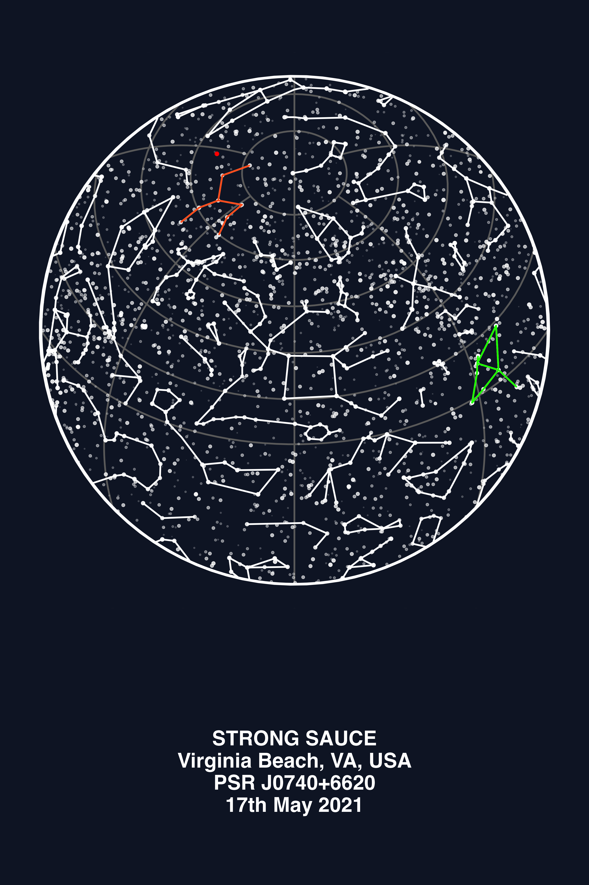

# Star Maps #

> The [data/](./data/) dir stores `*.json` files that conform to the style/syntax outlined by [`d3-celestial`, here.](https://github.com/ofrohn/d3-celestial/tree/master/data)

> [figs/](./figs/) stores all output images; generated by running the `R` scripts, or otherwise.

> [scripts/](./scripts) is where all the `R` and other code for generating sky-maps are stored.

> [notebooks/](./notebooks) to store `*.ipynb` notebooks

----
### Notes ###
When saving figs in `R` the pathing starts at the root directory, not a relative path from where the script is being stored/executed from.

To execute an R script, you can use VSCode shortcuts or:
```bash
cd scripts
Rscript star_chart_with_datetime.R
```

NOTE: Constellations rely on any external repo, so a copy of this file has been added to [here](./data/constellations.lines.json).

----

[binary companion paper](./other_data/binary_pair/stz607.pdf)


----
### Cool Links ###
[This repo](https://github.com/ofrohn/d3-celestial) is worth checking out for more interactive maps and various other things.

----
### Examples ###
<!-- 

**Make a chart with accurate map for entered location, date, and time**


**Make chart with multiple colors, using [`test_vb2021.R`](./scripts/test_vb2021.R):**



**Made using []()**

 -->

More examples are shown [here](./scripts/README.md#example-image-outputs).

<table>
    <tr>
        <td>
            <b>Strong Sauce:</b>
            
        </td>
        <td>
            <b>Multi-colored chart `./scripts/test_vb2021.R`:</b>
            
        </td>
    </tr>
    <tr>
        <td>
            <b>Accurate for given location, date, and time:</b>
            
        </td>
        <td>
            <b>Chart made using python script:</b>
            
        </td>
    </tr>
</table>
