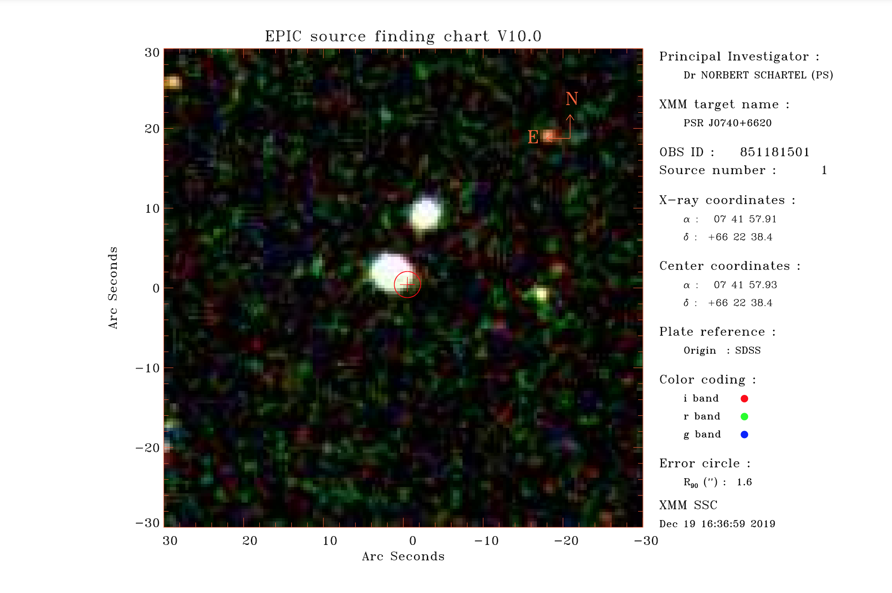
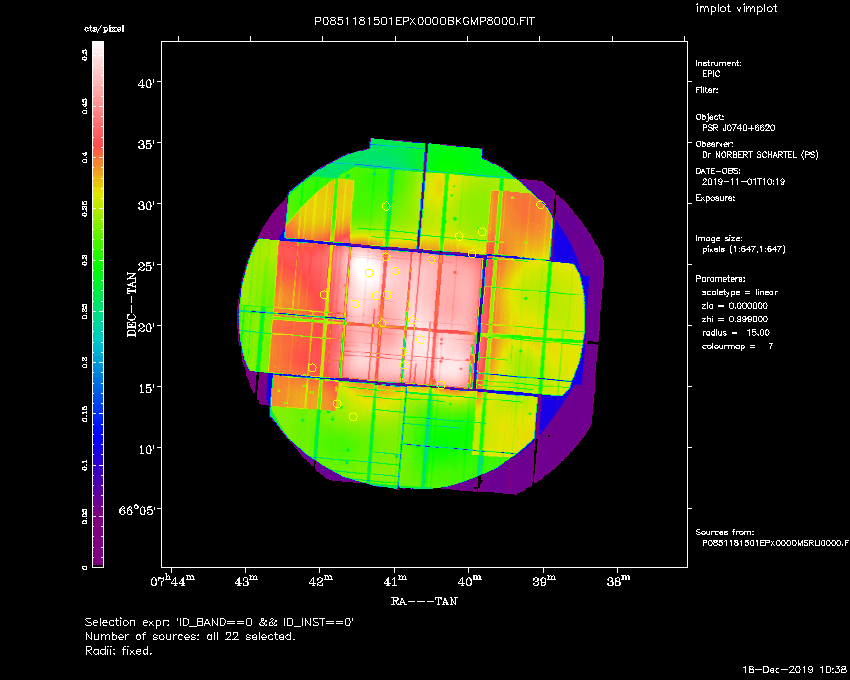

### PSR J0740+6620 Specific ###

Lots of `PSR J0740+6620` specific data can be seen here: [https://heasarc.gsfc.nasa.gov/FTP/xmm/data/rev0//0851181501/PPS/](https://heasarc.gsfc.nasa.gov/FTP/xmm/data/rev0//0851181501/PPS/)

Sweet stuff like [this.](https://heasarc.gsfc.nasa.gov/FTP/xmm/data/rev0//0851181501/PPS/P0851181501CAX000XCORRE0000.HTM)

- [`P0851181501CAX000CATPLT0000.PDF`](./P0851181501CAX000CATPLT0000.PDF)
- [`*.FIT`](./P0851181501EPX000OIMAGE8000.PNG)
- [`P0851181501EPX000OBKGMP8000.png`](./P0851181501EPX000OBKGMP8000.png)

Check out all these listed [here,](https://heasarc.gsfc.nasa.gov/FTP/xmm/data/rev0//0851181501/PPS/P0851181501CAX000FOVRES0000.HTM#Simbad) such as:

**BINARY PAIR?**

This image from gaia:

- links to (binary?) data
    - [1](https://heasarc.gsfc.nasa.gov/FTP/xmm/data/rev0//0851181501/PPS/P0851181501CAX000SRCRES0000.HTM#Simbad)
    - [2](https://heasarc.gsfc.nasa.gov/FTP/xmm/data/rev0//0851181501/PPS/P0851181501CAX000SRCSUM0000.HTM)

