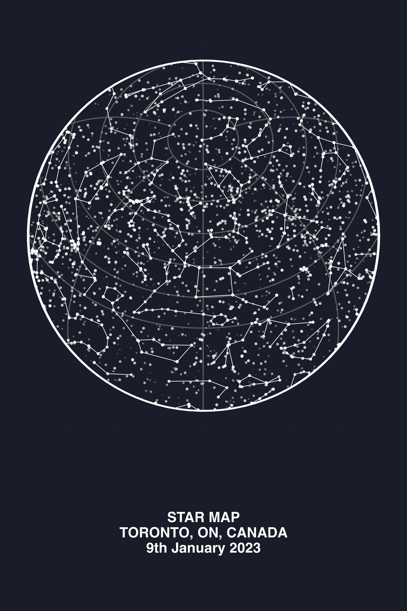
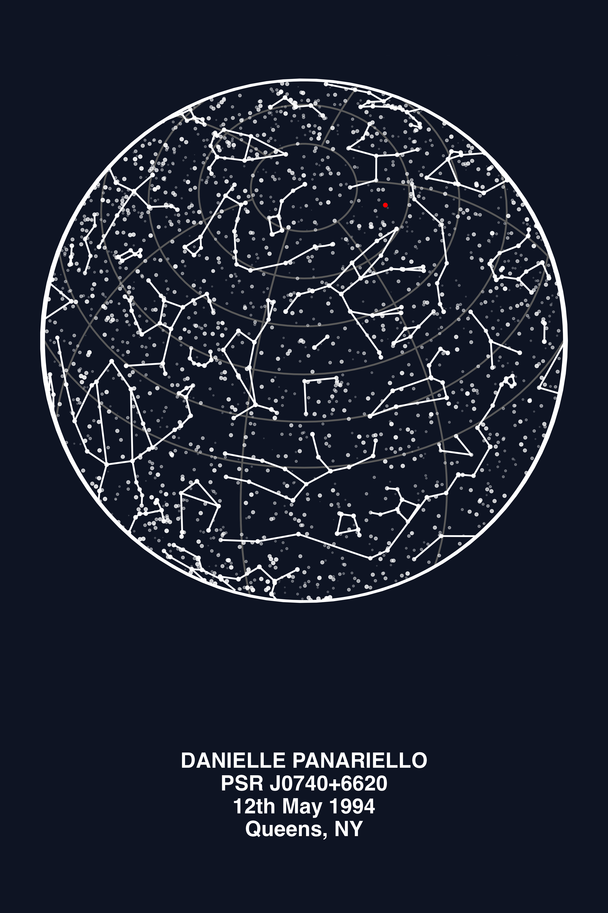
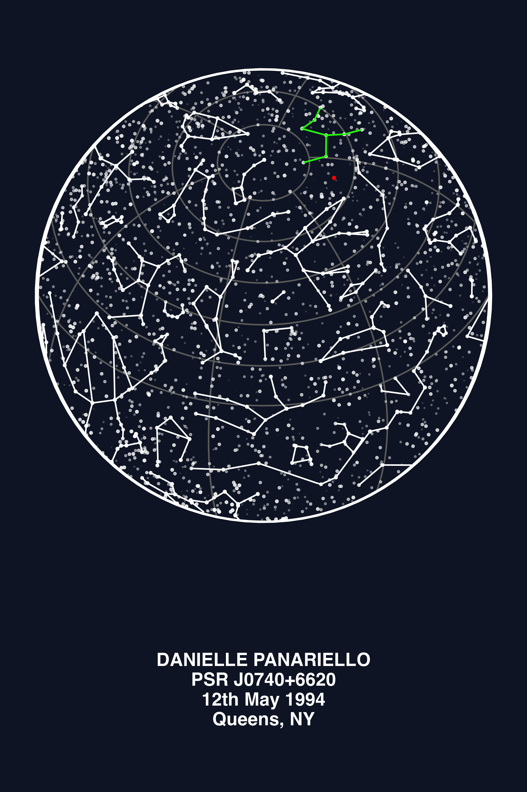
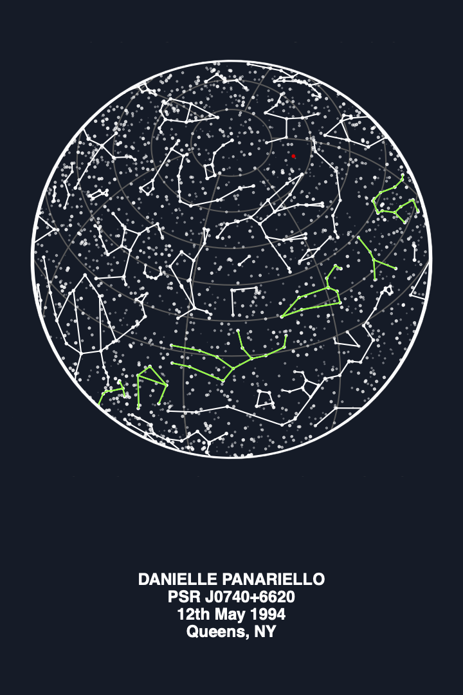

# Star Map `R` Scripts

To run the R code, use VSCode extension or shell command `Rscript name_of_script.R`.

Make a star chart for a given location, date and time:
```bash
Rscript star_chart_with_time.R
```

To modify the text at the bottom of the png/pdf, change the `caption` on 
line 94 of [star_chart_with_time.R](star_chart_with_time.R).


## Star Identification

Example of highlighting a single star in red:
```bash
Rscript star_chart_with_time_and_red_star.R
```


## Colored Text

One extra library is needed, but here is an example of how to make the same chart with different parts of the caption text shown in different colors:
```bash
Rscript star_chart_with_time_and_red_star_and_constellation_and_colored_text.R
```


## Constellations

Constellations rely on [https://raw.githubusercontent.com/ofrohn/d3-celestial/master/data/constellations.lines.json](https://raw.githubusercontent.com/ofrohn/d3-celestial/master/data/constellations.lines.json) so a copy of this file has been added to [here](../data/constellations.lines.json).

To get a list of all constellations visible for a given star map:
```bash
Rscript get_visible_constellation_list.R
```

To color one constellation in green, see:
```bash
Rscript star_chart_with_time_and_red_star_and_constellation.R
```

To color all zodiac constellation in green, see:
```bash
Rscript star_chart_with_time_and_red_star_and_zodiac_constellation.R
```

To see all possible constellation ids:
```bash
Rscript print_all_constellation_ids.R
```

To see just the zodiac constellation ids and info:
```bash
Rscript print_zodiac_constellations_name_table.R
```

Here is an example of how to write out a specific constellation to a JSON file, for the Taurus constellation, `"Tau"`, in NY on May 12th, 1994 at 17:30:
```bash
Rscript write_constellation_to_json.R
```


### Constellation id Table

When determining which constellation to color in, be sure it is visible at that datetime.

**NOTE**: Someone born on May 12, 1994 at 17:30, in NY, would be considered a Taurus. This means Taurus would be near the sun and not visible in the night sky. The constellations overhead would be Leo/Virgo. So astronomically, they were "born under" the portion of the sky near Leo / Virgo — NOT Taurus.

Here is a list of the JSON, keys for the zodiac signs, from the constellation lines stored in: [https://raw.githubusercontent.com/ofrohn/d3-celestial/master/data/constellations.lines.json](https://raw.githubusercontent.com/ofrohn/d3-celestial/master/data/constellations.lines.json) 
| Zodiac Sign | IAU Abbreviation (JSON `id`) |
| ----------- | ---------------------------- |
| Aries       | `Ari`                        |
| Taurus      | `Tau`                        |
| Gemini      | `Gem`                        |
| Cancer      | `Cnc`                        |
| Leo         | `Leo`                        |
| Virgo       | `Vir`                        |
| Libra       | `Lib`                        |
| Scorpio     | `Sco`                        |
| Sagittarius | `Sgr`                        |
| Capricorn   | `Cap`                        |
| Aquarius    | `Aqr`                        |
| Pisces      | `Psc`                        |

Here are all the available constellations and associated JSON id value:

| Constellation ID   | Notes                |
| ------------------ | -------------------- |
| `And`              | Andromeda            |
| `Ant`              | Antlia               |
| `Aps`              | Apus                 |
| `Aqr`              | Aquarius (Zodiac)    |
| `Aql`              | Aquila               |
| `Ara`              | Ara                  |
| `Ari`              | Aries (Zodiac)       |
| `Aur`              | Auriga               |
| `Boo`              | Boötes               |
| `Cae`              | Caelum               |
| `Cam`              | Camelopardalis       |
| `Cnc`              | Cancer (Zodiac)      |
| `CVn`              | Canes Venatici       |
| `CMa`              | Canis Major          |
| `CMi`              | Canis Minor          |
| `Cap`              | Capricornus (Zodiac) |
| `Car`              | Carina               |
| `Cas`              | Cassiopeia           |
| `Cen`              | Centaurus            |
| `Cep`              | Cepheus              |
| `Cet`              | Cetus                |
| `Cha`              | Chamaeleon           |
| `Cir`              | Circinus             |
| `Col`              | Columba              |
| `Com`              | Coma Berenices       |
| `CrA`              | Corona Australis     |
| `CrB`              | Corona Borealis      |
| `Crv`              | Corvus               |
| `Crt`              | Crater               |
| `Cru`              | Crux                 |
| `Cyg`              | Cygnus               |
| `Del`              | Delphinus            |
| `Dor`              | Dorado               |
| `Dra`              | Draco                |
| `Equ`              | Equuleus             |
| `Eri`              | Eridanus             |
| `For`              | Fornax               |
| `Gem`              | Gemini (Zodiac)      |
| `Gru`              | Grus                 |
| `Her`              | Hercules             |
| `Hor`              | Horologium           |
| `Hya`              | Hydra                |
| `Hyi`              | Hydrus               |
| `Ind`              | Indus                |
| `Lac`              | Lacerta              |
| `Leo`              | Leo (Zodiac)         |
| `Lep`              | Lepus                |
| `Lib`              | Libra (Zodiac)       |
| `Lup`              | Lupus                |
| `Lyn`              | Lynx                 |
| `Lyr`              | Lyra                 |
| `Men`              | Mensa                |
| `Mic`              | Microscopium         |
| `Mon`              | Monoceros            |
| `Mus`              | Musca                |
| `Nor`              | Norma                |
| `Oct`              | Octans               |
| `Oph`              | Ophiuchus            |
| `Ori`              | Orion                |
| `Pav`              | Pavo                 |
| `Peg`              | Pegasus              |
| `Per`              | Perseus              |
| `Phe`              | Phoenix              |
| `Pic`              | Pictor               |
| `PsA`              | Piscis Austrinus     |
| `Psc`              | Pisces (Zodiac)      |
| `Pup`              | Puppis               |
| `Pyx`              | Pyxis                |
| `Ret`              | Reticulum            |
| `Sge`              | Sagitta              |
| `Sgr`              | Sagittarius (Zodiac) |
| `Sco`              | Scorpius (Zodiac)    |
| `Scl`              | Sculptor             |
| `Sco`              | Scutum               |
| `Ser`              | Serpens              |
| `Sex`              | Sextans              |
| `Tau`              | Taurus (Zodiac)      |
| `Tel`              | Telescopium          |
| `TrA`              | Triangulum Australe  |
| `Tri`              | Triangulum           |
| `Tuc`              | Tucana               |
| `UMa`              | Ursa Major           |
| `UMi`              | Ursa Minor           |
| `Vel`              | Vela                 |
| `Vir`              | Virgo (Zodiac)       |
| `Vol`              | Volans               |
| `Vul`              | Vulpecula            |

----
## Example Image Outputs
<details>
  <summary>Click to expand/collapse the table of image examples...</summary>


### Images produced by `R` Code

<table>
    <tr>
        <td>
            
        </td>
        <td>
            
        </td>
    </tr>
    <tr>
        <td>
            
        </td>
        <td>
            
        </td>
    </tr>
    <tr>
        <td>
            
        </td>
        <td>
            
        </td>
    </tr>
</table>

</details>